# fungo split keyboard v1.0.
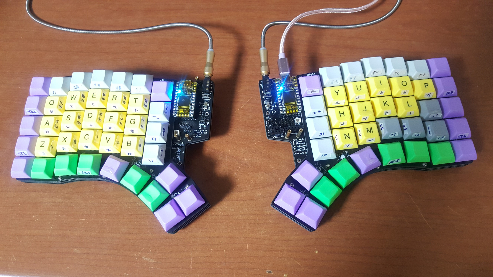

## fungo split keyboard 는
기계식 스위치를 사용하고 qmk, zmk 사용을 기반으로 하는 분리형 키보드. 

## 왜 만들었을까?

실력 없는 늙은 개발자.

오래 일할 땐 손가락, 손목 통증 때문에 20년 넘은 PS2 타입 삼성 키보드를 사용했었다.

어쩌다 분리형 키보드가 있는 것을 보고 구해보려고 했는데 웬걸?

너~무 비싸기도 하거니와 키 배치도 맘에 드는 것이 없어.

그래서 할 수 없이 없는 실력 끌어모으고 옛 기억 더듬어서 새로 만들기로 했어.

**없는 실력에 만드느라 힘들었는데 그런데로 쓸만함. 다이오드 납땜만 아니었으면...**

## 개요 
- 좌우 각 38key(5x7+3)로 구성됨.
- 체리스위치, 카일스위치 부착가능, 핫 스왑 가능
- 검지 손가락에 3줄의 키를 할당함.
- 제일 아래줄은 엄지 손가락을 펼쳐서 사용할 수 있도록 곡선으로 배치
- 리튬 폴리머 배터리 전원 스위치 추가(nicenano 사용할 경우)
- 리튬 폴리머 배터리 연결 단자 추가(nicenano 사용할 경우)
- 마우스 추가를 위한 spi 통신용 연결단자 추가(오른쪽에만 가능, i2c 불가)
- 왼쪽에만 oled 판넬 추가가능함.
- 설계일 기준 국내에서 모두 구매 가능한 부품으로 구성함.(스위치 구성품 제외)
- qmk 사용시 좌우 통신포트를 사용자가 지정할 수 있음.(tx or rx) 

## 문제점 및 특이사항
- 엄지 손가락으로 입력이 불편한 키 발생함.(여유분으로 사용중)
- 회로 설계 실수로 인하여 마우스 스위치용으로 배치한 연결단자 사용불가.
- 최종 조립시 컨트롤 보드와 기판의 간섭이 발생할 수 있음-컨트롤보드 부착시 최대한 간섭되지 않게 밀어서 설치해야함.
- 다이오드의 납땜 패턴이 smt기준으로 되어 수작업으로 납땜하기에는 어려운 편임-납땜 실력이 좀 있어야 작업가능.(아트웍 작업 실수)
- 좌우 대칭이 아님.
- 카일 스위치는 현재 부착해보지 않음.
- nanonice 보드는 설치해보지 못함(zmk 사용법을 몰라서)

## 주요부품

| 부품 | 수량 | 설명 | 비고|
|:--|:--|:--|:--|
| 상부 pcb | 2 | 스위치 프레임| 주문생산 |
| 패턴 pcb | 2 | 컨트롤러 및 전자부품 설치| 주문생산 |
| 하부 pcb | 2 | 하부 덮개| 주문생산 |
| Kailh PCB Socket - CPG151101S11 | 76 | 체리 스위치 핫스왑 소켓|  체리 스위치 사용할 경우 |
| Kailh PCB Socket - CPG135001S30 | 76 | 카일 스위치 핫스왑 소켓|  카일 스위치 사용할 경우 |
| 스위치 - 1U | 76 | 키보드 스위치 | 모든 규격이 1U |

## 부품
- 판매처 : 디바이스 마트

| 부품 | 수량 | 설명 | 비고|
|:--|:--|:--|:--|
| 핀헤더 HD200-40핀 (2mm), 사각핀  | ? | 점퍼용 | 필요한 크기로 잘라서 사용, 필요한 위치에만 사용가능|
| 핀헤더소켓 Single Straight(2.54mm), 사각핀용  | ? | 마우스 외부연결| 필요한 크기로 잘라서 사용, 필요한 위치에만 사용가능|
| 양방향 핀헤더 Single 40Pin (2.54mm), 원형핀용| ? | 컨트롤 보드 연결용 | 컨트롤 보드를 교체형으로 할때에만 필요|
| 53047-02 소켓 | 2 | 리튬폴리머 배터리 소켓 | nanonice 컨트롤러 사용할 경우 |
| 마이크로 슬라이드 스위치 [NW3-SK-02] | 2 | 배터리 전원 스위치 |nanonice 컨트롤러 사용할 경우|
| 1N4148WS (SOD-323) | 76 | 각 스위치에 | 납땜 실패를 고려해서 여유있게 |
| ITS-1107 | 2 | TACT 스위치 | 컨트롤러 리셋 |
| DS1027 -점퍼(OPEN) pitch:2mm  | 3~11 | 컨트롤러 포트 설정 | 최소3개 이상이면 외부 마우스 연결없이 사용가능|
| 십자둥근머리 M2x4  또는 M2x5 | ? | 황동2파이 고정용 | 필요한 만큼 |
| lcd서포트 황동2파이 F-7mm  | ? | 패턴 pcb관통하여 상,하판 연결 | 필요한 만큼, 8mm가 있을 경우 8mm 추천 |
| lcd서포트 황동2파이 F-15mm | 8 | 컨트롤러 덮게 아크릴 고정용 | 덮게 사용할 경우만 |
| NT-B10-FOOT  | ? | 미끄럼방지용 | 필요한 수량만큼 |

## 부품
- 판매처 : 엘레파츠

| 부품 | 수량 | 설명 | 비고|
|:--|:--|:--|:--|
| 폰잭 PJ320D SMD | 2 | AUX 케이블 연결용 | nanonice  사용할 경우 불필요|
| 310-87-164 Straight Socket Connector 64pin 2.54mm, 원형핀용  | ? | 컨트롤 보드 연결용 |컨트롤 보드를 교체형으로 할때에만 필요|
| coms 스테레오케이블(3.5/4극) NT940 | 1 | 좌우 키보드 데이터 전송용 | 원하는 제품으로 변경가능|
| 리튬폴리머 tw-501230 배터리 | 2 | 블루투스를 위해서 |nanonice 컨트롤러 사용할 경우, 배터리 두께는 조정가능|

## 조립
### 다이오드, 1N4148WS (SOD-323)
- pcb의 납땜용 패턴이 smt 기준으로 작업이되어 매우 면적이 작음. 따라서 손으로 납땜하기가 매우 어려우므로 조심스럽게 해야함.
- 다이오드 자체도 매우 작음.
- 초보자의 경우 많은 연습이 필요함.

**절대 쉽게 보면 안되고 납땜후 냉납여부를 반드시 확인해야함, 세척하고 확인을 여러번 할 것을 권장**

.jpg)
.jpg)

- 납땜 되어있는 상태, 너무 작어서 잡기도, 고정하기도 땜하기도 힘들다. 노안이면 더 어려움 ㅠ.ㅠ
- 확대경, 핀셋, 카메라 확대경 등 다 동원했으나 제자리에 놓는것 자체가 힘들었다. 맨눈으로는 힘들것...
- 현재 사용하고 있는 키보드의 상태.

.jpg)

### 핫스왑 소켓, Kailh PCB Socket - CPG151101S11 또는 Kailh PCB Socket - CPG135001S30
- 키보드 스위치를 교체할 수 있도록 소켓을 사용하였으며 체리mx, 카일Choc 스위치중 원하는 제품으로 가능.
- 핫스왑 소켓을 사용하므로 스위치는 5핀(스위치 단자2개, 고정핀3개)이 있는 제품으로 추천.
- pcb에 mx로 인쇄된 부분에 체리용 소켓을, 1350으로 인쇄된 부분에 카일용 소켓을 설치.
- 소켓 납땜시 PCB에 완전히 밀착시켜야 함, 들뜨거나 기울어져 납땜되면 스위치조립이나 케이스 조립시 안맞을 수 있음.
- 체리, 카일 스위치 두 개를 사용하므로 소켓및 스위치 핀의 유격이 약간 있음(두 종류의 스위치의 핀 형상이 다름).
- 체리 MX 스위치는 현재 사용중이나 카일 스위치는 아직까지 최종 조립해보지 않음.

납땜하지 않고 끼운 상태임, swr62:체리스위치용, swr45:카일스위치용

납땜하지 않고 끼운 상태임, 위:체리스위치용, 아래:카일스위치용

체리 mx 스위치

### 컨트롤러 보드
- pro micro, elite-c, nicenano(블루투스) 보드를 사용할 수 있다.
- elite-c 보드를 위한 추가 5핀을 위한 단자가 있음(점퍼로 설정가능).
- 컨트롤러 보드를 설치할 때 상부 pcb와 간섭이 발생할 수 있다.(왼쪽의 경우 컨트롤러 왼쪽부, 오른쪽의 경우 컨트롤러 오른쪽부)
- 간섭을 피하기 위해서는 컨트롤러 설치시 tack스위치 방향으로 최대한 밀착해야함. 또는 상부 pcb를 약간 갈아내야 함.
- 컨트롤러 보드는 pcb에 바로 납땜하는 경우와 소켓을 pcb에 납땜하고 소켓에 끼우는 방식을 사용할 수 있다.
- 컨트롤러 보드의 연결 구멍의 크기가 작아 사각형핀은 사용할 수 없으므로 둥근핀을 사용해야 함.
- 소켓:310-87-164 Straight Socket Connector 64pin 2.54mm(엘레파츠), 핀과 소켓이 함께 있음.
- 핀헤더:양방향 핀헤더 Single 40Pin 2.54mm(디바이스마트), 핀이 양방향으로 있음, 컨트롤러 보드에 납땜후 잘라냄.

elite-c 보드에 양향향 핀헤더를 납땜한 후 잘라낸 상태, 양방향 핀헤더의 조립방법은 여러가지로 가능하다.

소켓(위), 양방향 핀헤더(아래)

elite-c 보드와 소켓이 조립되는 상태(아래의 소켓이 pcb에 납땜된다)

elite-c 보드의 추가 포트용(빨간색), nicenano 보드의 배터리 연결단자(보라색), 사진은 오른쪽 키보드임.
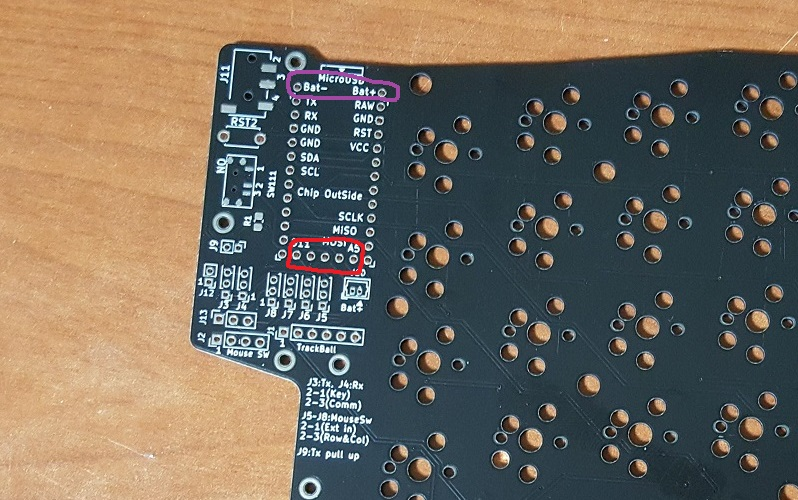

### 점퍼용 핀헤더(피치2mm), 외부 연결용 핀헤더 소켓(피치2.54mm)
- 컨트롤러의 포트를 설정하기 위해서 점퍼를 이용해서 설정함.

**오른쪽 키보드 점퍼핀**
- J12: nicenano 모듈 사용시 raw핀과 배터리 +극을 연결시켜야 할때, nicenano 설명서 확인.
- J9 : 좌,우 키보드 통신용 포트의 풀업저항 사용 - 현재 필요하지 않음.
- J3 : D3번 포트의 설정, 1-2:D3번 포트를 스위치 입력으로 사용, 2-3:D3번 포트를 통신선으로 사용
- J4 : D2번 포트의 설정, 1-2:D2번 포트를 스위치 입력으로 사용, 2-3:D2번 포트를 통신선으로 사용
- J3, J4번 점퍼는 서로 엇갈리게 설정해야함.
- J5~J8 은 elite-c, nicenano의 추가 포트에 대해서 스위치입력 및 외부 연결을 목적으로 했으나 스위치 입력으로 사용할 경우 문제가 있으므로 외부 입력으로 사용해야함.(설계오류)
- J5 : 1-2번만 가능, elite-c 보드의 B7번 포트와 J2 소켓의 1번핀을 연결함.
- J6 : 1-2번만 가능, elite-c 보드의 D5번 포트와 J2 소켓의 2번핀을 연결함.
- J7 : 1-2번만 가능, elite-c 보드의 C7번 포트와 J2 소켓의 3번핀을 연결함.
- J8 : 1-2번만 가능, elite-c 보드의 F1번 포트와 J2 소켓의 4번핀을 연결함.

**오른쪽 키보드 핀헤더 소켓**
- 외부 연결(마우스용 포인팅 장치, 마우스용 스위치)용으로 준비
- J13 : nicenano 보드를 사용할 경우 보드의 추가 포트와 연결용으로 준비(추가 점퍼선 필요), 3개의 포트를 사용할 수 있다.
- J13은 J2의 1, 2, 3번 핀과 연결된다. 또한
- J2 : elite-c의 모든 핀을 사용할 때, nicenano의 추가 3핀을 J13을 연결했을 때 사용할 수 있다.(Mouse SW로 인쇄됨)
- J1 : 마우스 포인팅 장치연결하기 위해서 spi 통신을 위한 4핀, 전원 2핀으로 구성됨. 트랙볼 spi 모듈을 추가할 수 있다.(TrackBall로 인쇄됨)
- J10 : nicenano를 사용할 때 필요한 배터리를 연결하기 위한 잭, 준비한 배터리의 잭 모양과 극성을 반드시 확인해야 함.

오른쪽 키보드로 J3은 2-3번 , J4는 1-2번으로 설정됨

**왼쪽 키보드 점퍼핀**
- J22 : 좌,우 키보드 통신용 포트의 풀업저항 사용 - 현재 필요하지 않음.
- J23 : 좌,우 키보드 통신용 포트의 선택, 1-2:D3번 포트를 사용, 2-3:D2번 포트를 사용
- qmk 펌웨어에서 하나의 펌웨어를 사용할 경우 통신 포트는 같아야 한다.
- J26: nicenano 모듈 사용시 raw핀과 배터리 +극을 연결시켜야 할때, nicenano 설명서 확인.

**왼쪽 키보드 핀헤더 소켓**
- J24 : nicenano를 사용할 때 필요한 배터리를 연결하기 위한 잭, 준비한 배터리의 잭 모양과 극성을 반드시 확인해야 함.
- J21 : OLED 모듈 연결용, 왼쪽에만 oled모듈을 추가할 수 있으며 한쪽만 있을 경우 펌웨어가 지원되는지 알 수 없음.(테스트 해보지 않음)

왼쪽 키보드로 J23은 1-2번으로 설정됨

### 배터리용 스위치, 폰잭
- 스위치는 배터리 차단용으로, 폰잭은 좌우 키보드 통신용으로 사용, 모두 smd타입
- 스위치의 단자가 작으므로 납땜시 다른 부품보다 먼저 하는 것이 유리하다.

### 스위치 프레임 pcb
- 스위치를 끼우는 곳으로체리 mx, 카일Choc 스위치 모두 호환되게 하였으나 카일 스위치의 경우 사용해보지 않아 설치했을 경우 유격은 알 수 없음.
- mx 스위치를 프레임에 끼울 경우 전용 공구 없이 빼기는 매우 어려움.
- 좌,우 구분없이 사용이 가능하다.
- 스위치가 배치되지 않는 공간에 그림이 인쇄되어 있다.(한쪽 면에만 인쇄되어 있으므로 보기 싫을 경우 뒤집어서 사용 가능)

왼쪽, 뒤집으면 오른쪽으로 사용 가능

오른쪽, 뒤집으면 왼쪽으로 사용 가능
.jpg)
왼쪽, 오른쪽 뒷면

### 패턴 pcb
- 전자 부품이 납땜되는 곳으로 프레임 pcb아래에 설치된다.
- 좌,우 패턴이 달라 서로 호환되지 않는다.
- 왼쪽 키보드의 윗면에는 그림이 인쇄되어 있다.

왼쪽 윗면
.jpg)
왼쪽 아랫면

오른쪽 윗면
.jpg)
오른쪽 아랫면

### 하부 케이스 pcb
- 아래쪽 케이스로 사용한다.
- 좌,우 구분없이 사용이 가능하다.
- 그림이 인쇄되어 있다.(한쪽 면에만 인쇄되어 있으므로 보기 싫을 경우 뒤집어서 사용 가능)

.jpg)
.jpg)
.jpg)

### 기타
조립된 상태
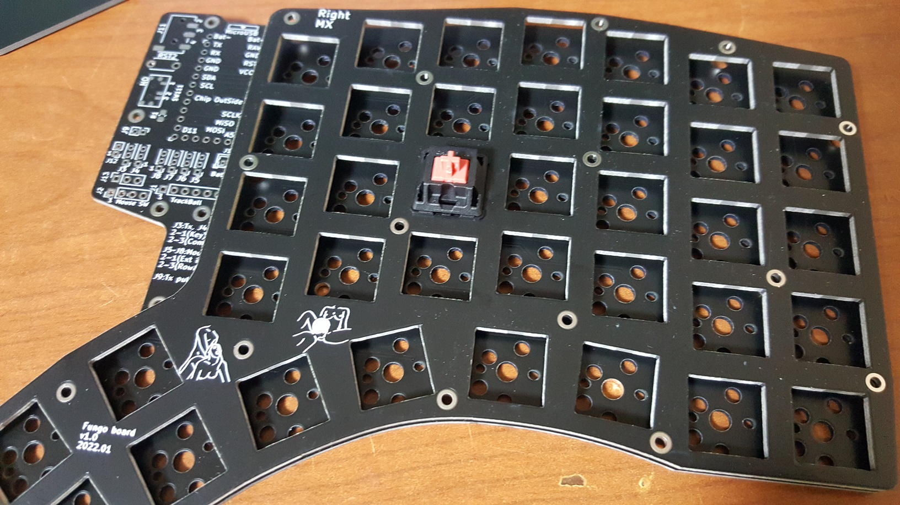

스위치 조립했을 때 뒷면
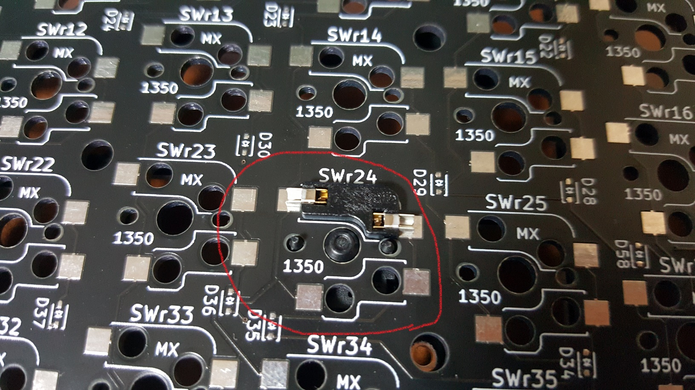
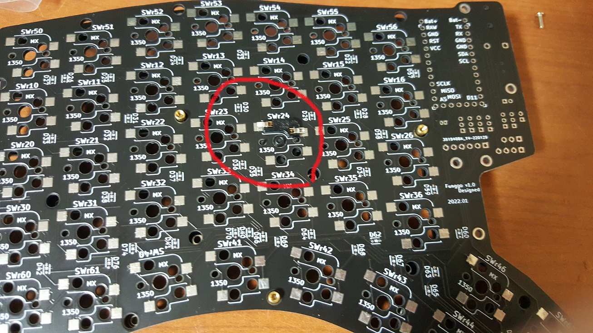
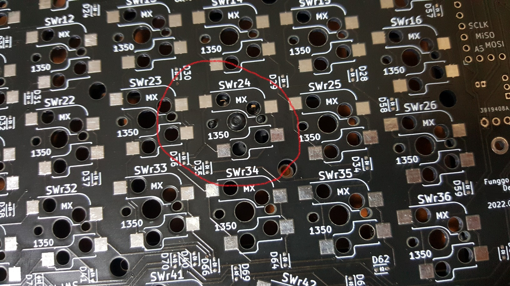

바닥 케이스 pcb에 황동 서포터 조립된 상태

황동 서포터

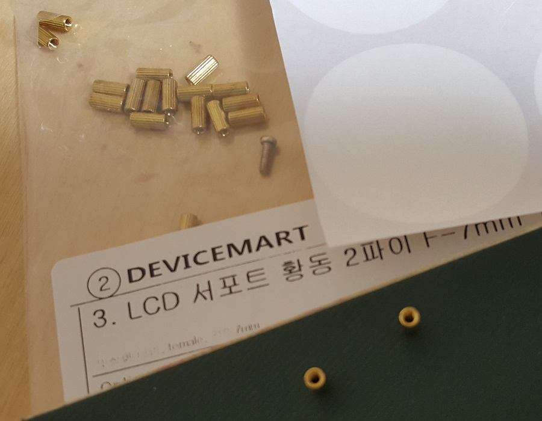

현재 사용중인 Elite-c 컨트롤 보드에 양방향 핀헤더 납땝한 상태
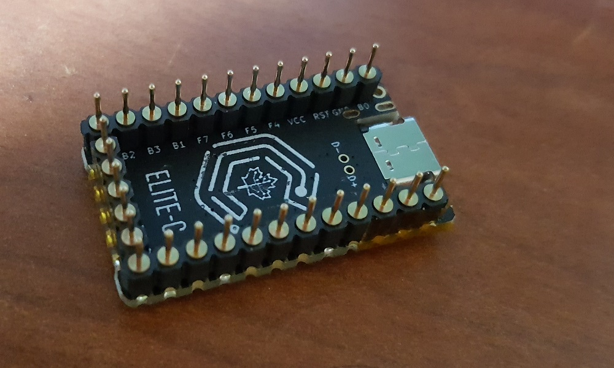

왼쪽 키보드에서 컨트롤러 보드를 제거한 상태, 소켓 커넥트를 사용하여 컨트롤러를 교체형으로 함, 컨트롤러 보드 아래에 배터리를 놓기 위해서 빈 공간에 캡톤 테이프로 채웠음. 빨간색 화살표 부위가 상부 pcb 와 컨트롤러 보드가 간섭을 일으키는 부분.
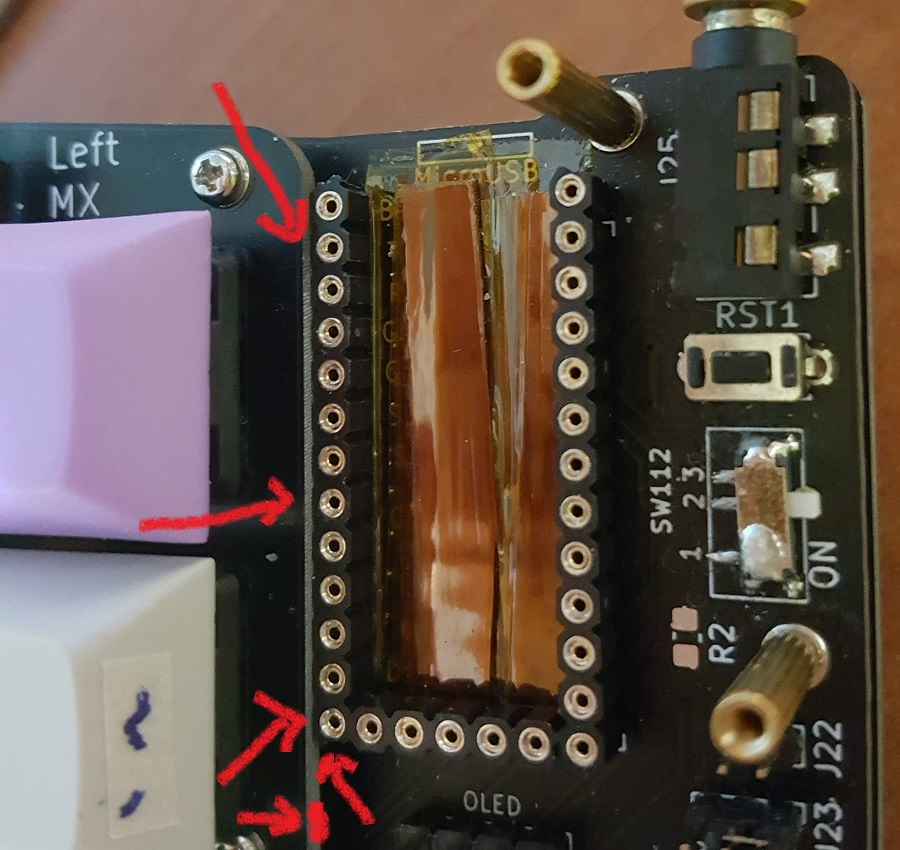

폰잭

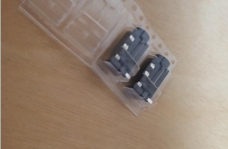

스위치 스왑 소켓

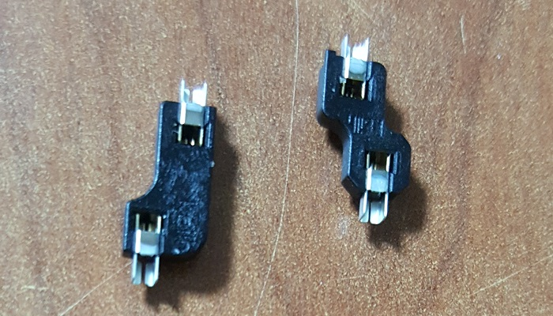
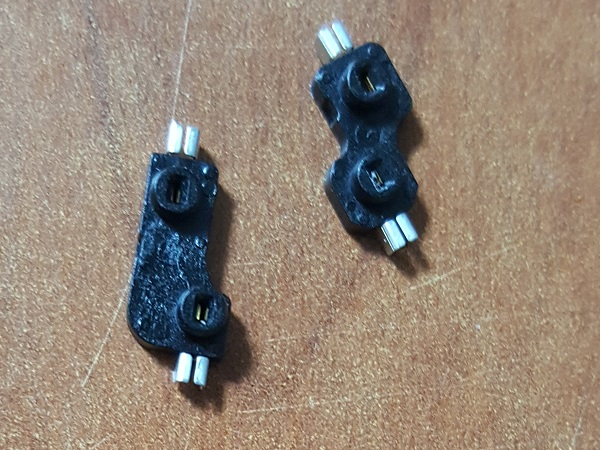

체리 mx 스위치
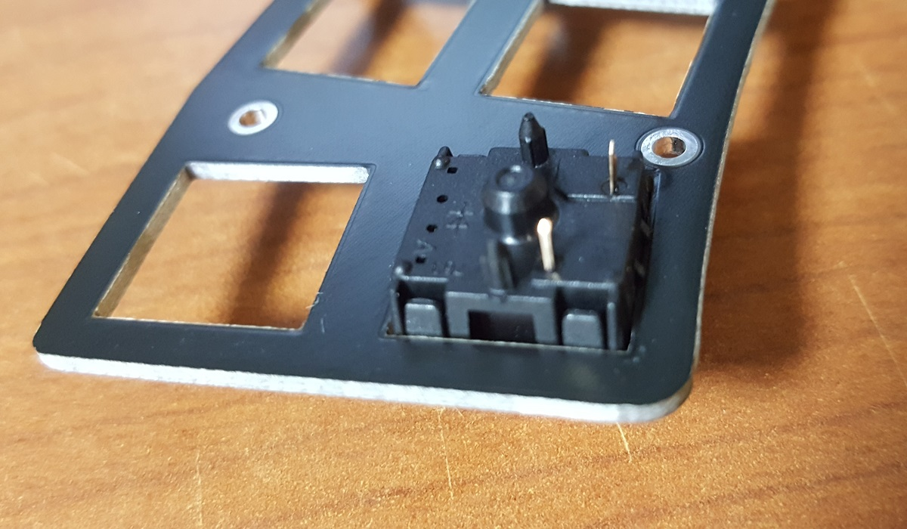
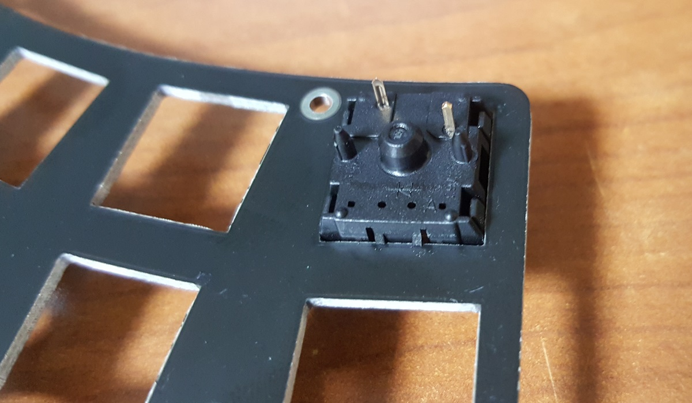
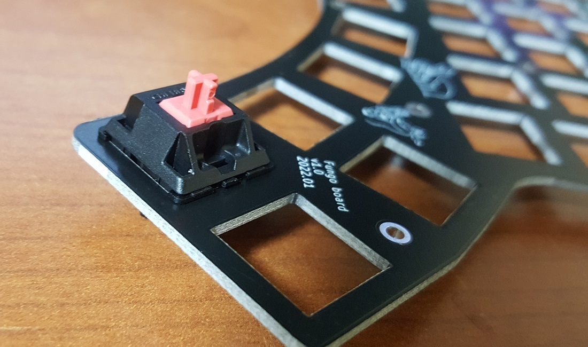
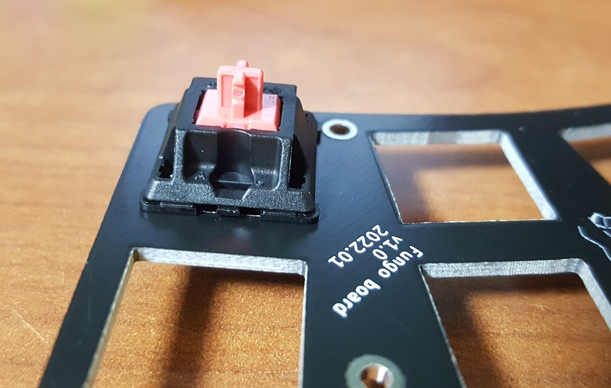

케이스 바닥에 사용한 풋, 미끄럼 방지
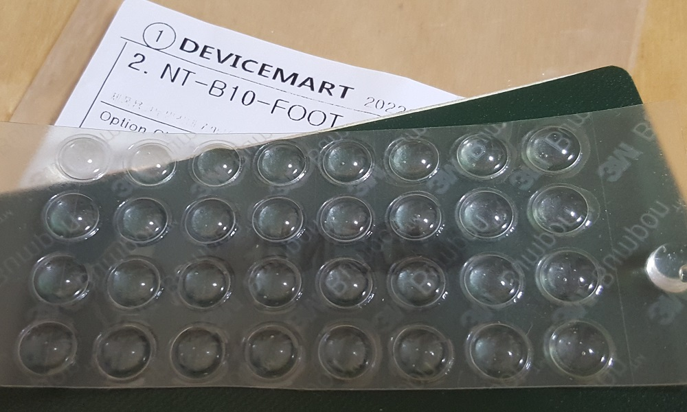

## 펌웨어 인스톨-qmk
- 현재 qmk만 테스트 했으며 사용하고 있음.
- 코드를 다운 받은후 qmk폴더에 있는 fungo 폴더를 qmk 라이버러리의 keyboards 폴더에 넣고 컴파일 한다.
- 현재 설정은 오른쪽 키보드에 usb전원을 공급하도록 되어있다.
- qmk 라이버러리는 https://github.com/qmk/qmk_firmware 에서 다운 받을 수 있다.

